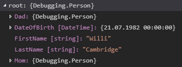
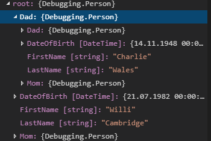
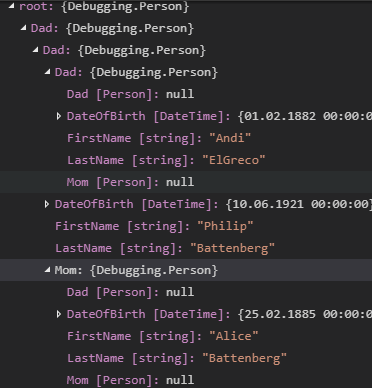
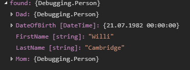
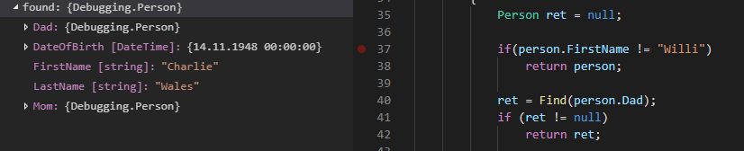
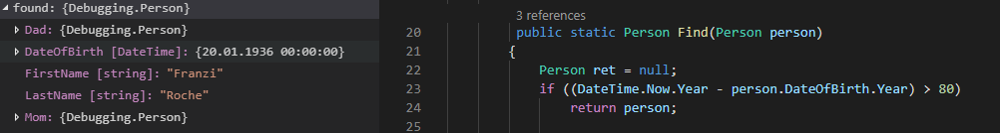

# Protokoll

### BuildTree()

in root wird als erstes Willi Cambridge mit seinem DateofBirth angezeigt inklusive seiner Eltern Mom und Dad

wenn man z.B. Dad aufklappt werden dessen Daten und Eltern angezeigt

das geht bis zum letzten Eltern Paar

damit ist es auch sichtbar das die Datenstruktur rekursiv ist.

### found()

### Ändert die Bedingung so, dass nicht gleich die erste Person ("Willi") zurückgegeben wird.

hier habe ich noch die reihenfolge von zuerst Mom in zuerst Dad geändert. Damit wurde als erste Person der Vater von Willi Cambrige gefunden.

### Person Ü 80 

Franzi Roche

### Person zwichen 40 und 60

